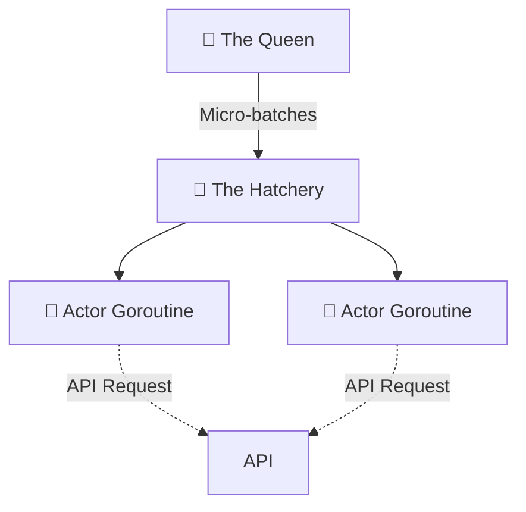

---
hide:
  - navigation
  - toc
---

<div class="tx-container" markdown="1">

<div class="tx-hero">
  
  <h1>High-fidelity API traffic simulation from your IDE.</h1>
  <p>Gopher-Glide (gg) is an open-source, high-fidelity API traffic simulator. Move beyond brute-force load testing with native IDE integration, zero-config profiles, and an interactive TUI that lets you inject chaos in real-time.</p>
  
  <div class="tx-hero-buttons">
    <a href="#quick-start" class="md-button md-button--primary">Get Started</a>
    <a href="https://github.com/shyam-s00/gopher-glide" class="md-button">View on GitHub</a>
  </div>
</div>

<div class="tx-feature-row" markdown="1">
<div class="tx-feature-text" markdown="1">

## The Hive Engine 🐝
**A modern architecture for massive scale.** While older tools rely on heavy OS threads or memory-intensive Virtual Machines, the newly released Hive Engine (v0.9.0) flips the paradigm with a pure-Go Actor Model.

By isolating each concurrent connection into an ultra-lightweight Goroutine and utilizing lock-free message passing, Gopher-Glide bypasses traditional memory and scheduling bottlenecks. A single instance can easily generate **over 50,000 RPS on a standard multi-core machine** with a proven zero-garbage (`0 allocs/op`) metrics subsystem. 

> **⚔️ Resource Benchmark:** At 30,000 RPS target load, `gg` consumes **40% less RAM** (1.42 GB vs 2.38 GB) and delivers **3x more successful requests** than `k6`. `gg`'s dynamic Adaptive Backpressure natively protects the target server by gracefully throttling excess traffic when the server locks up, ensuring maximum goodput instead of blindly pushing the network into a catastrophic deadlock. [Read the full benchmark breakdown](BENCHMARKS.md) to see how `gg` safely simulates massive traffic inside resource-constrained CI/CD pipelines.

Whether you are running on a high-end developer workstation, a standard laptop, or a virtualized cloud runner, the engine scales linearly to extract maximum value from your hardware. Check out the full [Performance Benchmarks](BENCHMARKS.md) to see the cross-platform scaling data.

</div>
<div class="tx-feature-visual" markdown="1">



</div>
</div>

<div class="tx-feature-row reverse" markdown="1">
<div class="tx-feature-text" markdown="1">

## Zero Scripting Required
Reuse your existing `.http` REST Client files directly. If you want to run a quick load test, there is no need to rewrite your API calls in JavaScript or Python. Just point `gg` at your existing IDE scratch files and go.

</div>
<div class="tx-feature-visual" markdown="1">

```http
### Simulated User Journey
POST http://api.example.com/login
Content-Type: application/json

{ "user": "tester", "pass": "secure" }

> 

### Fetch user profile using token
GET http://api.example.com/profile
Authorization: Bearer {{token}}
```

</div>
</div>

<div class="tx-feature-row" markdown="1">
<div class="tx-feature-text" markdown="1">

## Zero-Config Profiles
Skip writing complex YAML configs. Use built-in patterns like `--profile flash-sale` or `--profile ddos` to generate standard industry traffic shapes instantly.

Perfect for quick validation or CI/CD pipelines where you don't want to maintain external configuration files.

</div>
<div class="tx-feature-visual" markdown="1">

```bash
$ gg --hive-engine \
    --http-file checkout.http \
    --profile flash-sale

[Stages]
1. Ramp Up: 0 -> 1000 RPS (30s)
2. Sustain: 1000 RPS (2m)
3. Cool Down: 1000 -> 0 RPS (30s)

[Status] Running Stage 2 (Sustain)...
```

</div>
</div>

<div class="tx-feature-row reverse" markdown="1">
<div class="tx-feature-text" markdown="1">

## Interactive Chaos TUI
Adjust traffic in real-time using the newly polished, butter-smooth 30-FPS interactive TUI. Bias RPS up or down using your arrow keys, and watch the beautiful terminal UI react instantly without stutter or lag. 

Combined with the `--snap` flag, you can record behavioral snapshots of your API's latency, status distributions, and inferred JSON schemas.

</div>
<div class="tx-feature-visual" markdown="1">


</div>
</div>

<div class="tx-feature-row" markdown="1">
<div class="tx-feature-text" markdown="1">

## Semantic Diffing 🔬
**Know *why* your API broke, not just when.** Traditional tools tell you P99 latency spiked. `gg snap diff` tells you it spiked because a developer accidentally injected a 2MB blob into the JSON payload. 

By continuously sampling traffic, Gopher-Glide infers your API's schema in real-time. Compare two snapshots side-by-side to instantly spot missing fields, type changes, or massive payload bloat.

</div>
<div class="tx-feature-visual" markdown="1">

```text
GET:http://localhost:8080/fast-get  [❌ REGRESSION]

Latency Deltas      Payload Deltas      Error & Status
 P50:    +100.0%     Avg:    +100.0%     Error: -100.00 pp
 P95:    +100.0%     P95:    +100.0%
 P99:   +5200.0%     Max:    +100.0%     200:   +100.0 pp
 Max:    +785.7%

Schema Changes
 + active          added  boolean  100% STABLE
 + email           added  string   100% STABLE
 + metadata        added  object    18% RARE
 + metadata.source added  string    18% RARE
```

</div>
</div>

<div class="tx-feature-row reverse" markdown="1">
<div class="tx-feature-text" markdown="1">

## Automated CI/CD Gates 🚦
**Don't let regressions reach production.** Gopher-Glide is built for more than just local chaos testing. Drop it directly into your CI/CD pipelines to enforce hard limits on performance and payload shapes.

Use `gg snap assert` to automatically break the build if a Pull Request spikes P99 latency by 10% or removes a critical field from your JSON schema.

</div>
<div class="tx-feature-visual" markdown="1">

```yaml
jobs:
  api-regression:
    runs-on: ubuntu-latest
    container: shyam-s00/gopher-glide:latest
    steps:
      - name: Run API Simulator
        run: |
          gg --hive-engine \
            --http-file api.http \
            --snap --snap-tag ${{ github.sha }} \
            --headless

      - name: Enforce API Contracts
        run: |
          gg snap assert \
            --baseline main \
            --current ${{ github.sha }} \
            --latency-regression 10 \
            --deny-removed-fields
```

</div>
</div>

<div class="tx-steps-section" style="background: transparent; padding-top: 2rem; padding-bottom: 0;" markdown="1">
<h2>Why Gopher-Glide?</h2>
<p style="margin-bottom: 2rem; color: var(--md-default-fg-color--light);">If you want to run a quick concurrency test, you usually have to write a custom script or learn a heavy configuration language. <code>gg</code> lets you skip the boilerplate.</p>

| Feature | Gopher-Glide (`gg`) | k6 / Locust | wrk / hey / vegeta |
| :--- | :--- | :--- | :--- |
| **Scripting** | **None** (Reads `.http` natively) | JavaScript / Python | None (CLI flags only) |
| **Traffic Control** | **30-FPS Interactive TUI** (Arrow keys) | Requires configs | Fixed concurrency only |
| **CI/CD Assertions** | **Semantic JSON Diffing** (`gg snap`) | Pass/Fail Thresholds | Raw latencies only |
| **Built-in Profiles** | **Yes** (`--profile flash-sale`) | Requires scripting | No |
| **IDE Integration** | **Native JetBrains Plugin** | External scripts | External tools |
| **Performance** | **30k+ RPS per core (Actor Model)** | Medium-High | Extremely High |

</div>
<div class="tx-steps-section" markdown="1" id="quick-start">
<h2>Get started in minutes</h2>
<p class="tx-section-subtitle">No scripting language to learn, no config files to maintain — reuse what's already in your IDE.</p>

<div class="tx-steps-list" markdown="1">

<div class="tx-step-row" markdown="1">
<div class="tx-step-row-text" markdown="1">
<div class="tx-step-number">01</div>
<h3>Install</h3>
<p>Get the binary via Homebrew, or grab a prebuilt release for Linux/Windows.</p>
</div>
<div class="tx-step-row-code" markdown="1">

```bash
brew install shyam-s00/tap/gg
```

</div>
</div>

<div class="tx-step-row" markdown="1">
<div class="tx-step-row-text" markdown="1">
<div class="tx-step-number">02</div>
<h3>Write a Journey</h3>
<p>Reuse your existing <code>.http</code> files. Chain requests into a stateful Journey by exporting a value with <code>@gg-export</code> and referencing it as <code>{{token}}</code> in the next request.</p>
</div>
<div class="tx-step-row-code" markdown="1">

```http
### Login
# @gg-export token = jsonpath: $.data.token
POST http://api.example.com/login
Content-Type: application/json

{ "user": "tester", "pass": "secure" }

### Fetch profile
GET http://api.example.com/profile
Authorization: Bearer {{token}}
```

</div>
</div>

<div class="tx-step-row" markdown="1">
<div class="tx-step-row-text" markdown="1">
<div class="tx-step-number">03</div>
<h3>Pick a Profile</h3>
<p>Skip the YAML — choose a built-in traffic shape that matches your scenario.</p>
</div>
<div class="tx-step-row-code" markdown="1">

```bash
gg --hive-engine \
  --http-file checkout.http \
  --profile flash-sale
```

</div>
</div>

<div class="tx-step-row" markdown="1">
<div class="tx-step-row-text" markdown="1">
<div class="tx-step-number">04</div>
<h3>Simulate &amp; Watch</h3>
<p>Drop into the interactive TUI, bias load up or down with the arrow keys, and capture <code>--snap</code> snapshots as you go.</p>
</div>
<div class="tx-step-row-code" markdown="1">

```text
[Stages]
1. Ramp Up: 0 -> 1000 RPS (30s)
2. Sustain: 1000 RPS (2m)
3. Cool Down: 1000 -> 0 RPS (30s)

[Status] Running Stage 2 (Sustain)...
```

</div>
</div>

</div>
</div>

<div class="tx-steps-section" style="background: transparent; padding-top: 2rem;" markdown="1">
<h2>Frequently Asked Questions</h2>
<p style="margin-bottom: 2rem; color: var(--md-default-fg-color--light);">Everything you need to know about Gopher-Glide.</p>

<details class="faq">
  <summary>What is an API traffic simulator?</summary>
  <p>Unlike traditional <strong>API load testing tools</strong> that blindly spam endpoints, a traffic simulator like Gopher-Glide creates stateful, multi-step user journeys. It mimics human think-time and realistic behaviors, giving you high-fidelity insights into how your backend actually performs under real-world pressure.</p>
</details>

<details class="faq">
  <summary>Is Gopher-Glide a k6 or JMeter alternative?</summary>
  <p>Yes. If you are looking for a modern, <strong>open-source alternative to k6, JMeter, or Locust</strong>, Gopher-Glide offers a zero-code approach. Instead of writing complex JavaScript or Python scripts, you reuse your existing <code>.http</code> REST Client files directly from your IDE.</p>
</details>

<details class="faq">
  <summary>How much load can a single instance generate?</summary>
  <p>Thanks to the new pure-Go lock-free Hive Engine, a single Gopher-Glide instance can comfortably push <strong>over 50,000 RPS (Requests Per Second)</strong> on modern hardware without exhausting system memory or triggering garbage collection pauses.</p>
</details>

<details class="faq">
  <summary>Can I run this in my CI/CD pipeline?</summary>
  <p>Absolutely. You can use our official Docker image (<code>docker pull shyam-s00/gopher-glide</code>) to easily drop it into any CI/CD workflow like GitHub Actions or GitLab CI. By passing the <code>--headless</code> flag, Gopher-Glide outputs structured data instead of the UI. You can even use <code>gg snap assert</code> to create automated regression gates that break the build if API latency spikes.</p>
</details>
</div>

<div class="tx-cta-banner">
  <div class="tx-cta-title">Stop testing load. Start simulating reality.</div>
  <p>Open-source, highly concurrent, and built in Go.</p>
  <a href="https://github.com/shyam-s00/gopher-glide" class="md-button md-button--primary">Star us on GitHub ⭐</a>
</div>

</div>
